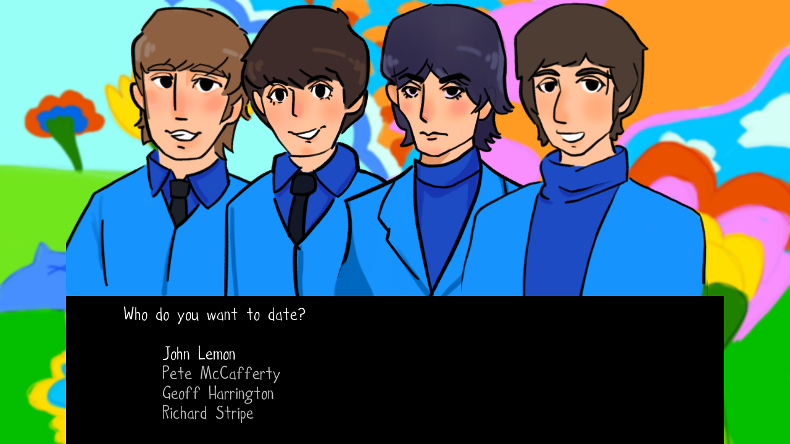

# Beebles Dating Simulator

Authors: Anne He and George Ralph

Design: This game gives players a unique dialog tree for each character they converse with. Each of the four Beebles have their own character art with differing expressions, to help indicate their moods.

Text Drawing: We render the text at runtime and store the texture for each glyph in a map.
As recommended/required, we used freetype and OpenGL to render the text, and harfbuzz to shape the text. OpenGL then draws the text using TextTextureProgram.
As suggested on https://learnopengl.com/In-Practice/Text-Rendering, a character struct stores information about the glyph. The glyph size, bearing, and advance are then used to place the vertices of the glyph.
hb_buffer_get_glyph_infos gets the glyph count instead of just using the character count.
The glyphs are loaded and added to the glyph map the first time it appears, and they are looked up using the glyph ID.
If the screen is resized, the font resizes and the font is reloaded, clearing the existing glyph map. 
Text wrapping is done by detecting spaces and checking if the text will exceed the text box width.
To simulate typing we add a new character to the harfbuzz buffer at regular intervals.

Screen Shot:

How To Play:

Get the once in a lifetime chance to talk with all four members of one of the biggest acts in music: The Beebles! Each of the four members: John Lemon, Pete McCafferty, Geoff Harrington, and Richard Stripe have their own dialog trees to converse with.

Use the up and down arrow keys to select a dialog response option. Press enter to say that option. Press enter to skip typing animation.

There is a bit of drama going on within the band, see if you can talk to each character to resolve the issue!

Also, everything scales with the window size! But you probably don't want to warp the art or make the screen really small for an optimal gameplay experience.

Sources:

Art by Anne. Writing by George.

Font "Hockey is Lif" by Tom Murphy, from http://fonts.tom7.com/.

Used 15-466 Game0 and Game4 base code.

For text rendering, referenced:

https://github.com/harfbuzz/harfbuzz-tutorial/blob/master/hello-harfbuzz-freetype.c

https://www.freetype.org/freetype2/docs/tutorial/step1.html

https://learnopengl.com/In-Practice/Text-Rendering

https://harfbuzz.github.io/index.html

https://github.com/ChunanGang/TextBasedGame

https://github.com/lassyla/game4

Drawing PNGs referenced:

https://github.com/kjannakh/15-466-f20-base4

Cross platform SSCANF define referenced:

https://www.gamedev.net/forums/topic/564260-sscanf_s-in-linux-ubuntu/

This game was built with [NEST](NEST.md).

All characters and musical groups in this game are purely fictional. Any resemblance to actual persons living or dead is purely coincidental.